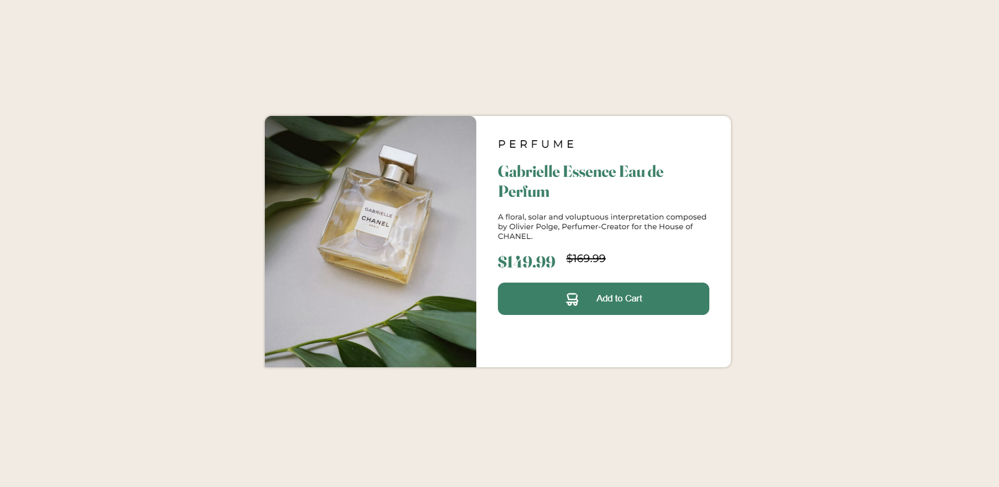

# Frontend Mentor - Product preview card component solution

This is a solution to the [Product preview card component challenge on Frontend Mentor](https://www.frontendmentor.io/challenges/product-preview-card-component-GO7UmttRfa). Frontend Mentor challenges help you improve your coding skills by building realistic projects. 

## Table of contents

- [Overview](#overview)
  - [The challenge](#the-challenge)
  - [Screenshot](#screenshot)
  - [Links](#links)
- [My process](#my-process)
  - [Built with](#built-with)
- [Author](#author)

## Overview

### The challenge

Users should be able to:

- View the optimal layout depending on their device's screen size
- See hover and focus states for interactive elements

### Screenshot

### Links

- Solution URL: [https://www.frontendmentor.io/solutions/product-card-component-react-typescript-lesscss-kV9BukMigY](https://www.frontendmentor.io/solutions/product-card-component-react-typescript-lesscss-kV9BukMigY)
- Live Site URL: [https://product-card-component-main.vercel.app/](https://product-card-component-main.vercel.app/)

## My process

### Built with

- Semantic HTML5 markup
- CSS custom properties
- Flexbox
- CSS Grid
- Mobile-first workflow
- [React](https://reactjs.org/) - JS library
- [LessCSS](https://lesscss.org/) - CSS Framework
- [TypeScript](https://typescriptlang.org) - TypeScript

## Author

- Website - [Josh Mo](https://joshmo.dev)
- Frontend Mentor - [@joshua-mo-143](https://www.frontendmentor.io/profile/joshua-mo-143)
- Twitter - [@joshmo_dev](https://www.twitter.com/joshmo_dev)
